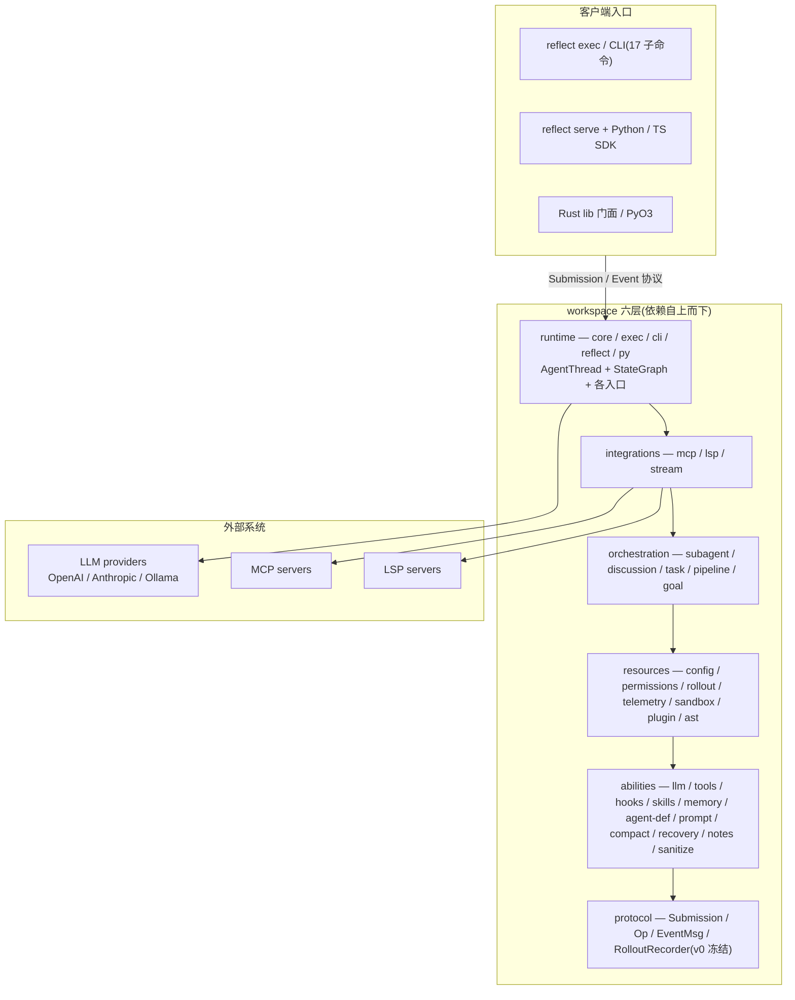
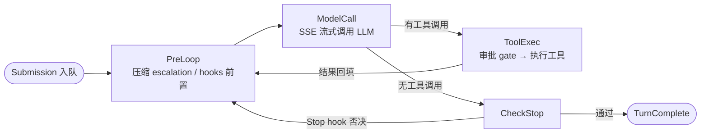

# Reflect

[简体中文](README.md) | **English**([README_EN.md](README_EN.md))

> Rust 编写的 AI agent 运行时**框架**:33 crate workspace(6 层架构)、
> 4 节点 StateGraph 引擎、23 内置工具、10 hook 事件、多 LLM provider、
> MCP / LSP 集成、JSONL rollout 持久化。
>
> 本仓库是**纯框架层**:主接口为 `reflect` 库门面(Builder + 60+ re-exports)
> 与 Rust / Python / TypeScript 集成入口;`reflect-cli` 只是附带产出的薄
> headless 入口(单一 `reflect` 二进制,含 SDK 用的 `serve` 子命令)。
>
> 脚本生态(Python / TS)可经 `reflect serve` + 官方 SDK 直接嵌入:
> spawn 二进制、走 JSONL stdio 协议、把**本地函数注册成 LLM 可调用的
> 自定义工具** —— Rust 引擎跑推理与编排,业务逻辑留在宿主语言。

**0.0.1** · 33 crate · **2200+ tests** · Apache-2.0

## 差异化特点

同类 agent 工具大多是"**黑盒 CLI**":单一可执行程序、内部循环不透明、
用户只能作为终端使用者驱动。Reflect 的定位相反 —— **可嵌入、可审计、
可二次开发的 agent 运行时框架**,差异集中在:

| 维度 | 常见 agent CLI | Reflect |
|------|----------------|---------|
| 产品形态 | 单一黑盒可执行程序,只能"用" | **纯框架 + 多语言入口**:`reflect` Rust 库门面(Builder + 60+ re-exports)、PyO3 绑定、`reflect serve` + Python / TS 官方 SDK;CLI 只是附带入口,可嵌入自有产品 |
| 控制流 | 内部循环不透明、不可干预 | **显式 4 节点 StateGraph**(PreLoop → ModelCall → ToolExec → CheckStop):转移手写、可审计,Stop hook 可否决结束、强制续跑 |
| 客户端协议 | 交互逻辑绑死在进程内 | **冻结的 Submission / Op / EventMsg wire 协议(v0)**:任何语言 / 形态的客户端走同一协议驱动 agent,框架新增变体不断既有 SDK |
| 自定义工具 | 工具必须进 CLI 进程或另起 MCP 服务器 | **宿主语言函数直接注册为 LLM 工具**:core 下发执行请求,Python / TS handler 本地执行并回执,工具代码不进 Rust 进程 |
| 工具面裁剪 | 工具集固定,给什么用什么 | **工具面配置化裁剪**:Agent 定义 frontmatter(`tools` 白名单 / `disallowed_tools` 黑名单 / `readonly`)、config.toml `[[subagents]]` 的 `allowed_tools`、或代码层 ToolRegistry 增删;被裁工具的 schema 不发给 LLM,tool 面更小、误触更少、更省 token |
| 常驻会话 | 每次调用冷启动 | **`reflect serve` 常驻会话服务**:一个进程 = 一个常驻 AgentThread,多轮共享内存状态 + resume,SDK 以子进程方式嵌入 |
| 多 Agent | 手工拼脚本 | **一等公民编排层**:子代理(Tool-per-Agent)、顺序 / 并发讨论、任务 / 团队、DAG pipeline、goal 模式 |
| 上下文管理 | 截断或单一摘要 | **4 层压缩 escalation**:microcompact → smart_prune → LLM summarize,按 token 阈值逐级升级 |
| 扩展面 | 零散 flag 与配置文件 | **hooks(10 事件 × 7 决策)+ Tool trait + MCP + LSP + 插件 + skills**,多层独立扩展机制 |
| 会话审计 | 日志散落、难以回放 | **JSONL rollout 持久化** + resume + session 索引 + LLM 调用 traces 全量落盘 |
| 安全边界 | 逐条人工确认 | **权限规则引擎 + 多级 sandbox + Plan mode**(写操作前强制只读调研,`ExitPlanMode` 才放行) |
| 自动化 / CI | 解析自然语言输出 | **JSONL stdout + stderr 日志**管道友好(`reflect exec \| jq`),内置 mock provider,examples / e2e / SDK 测试**全离线** |
| 运行时依赖 | 依赖宿主语言运行时 | **Rust 单二进制**(MSRV 1.85),无外部运行时依赖 |

一句话:常见 agent CLI 是给用户**用**的工具,Reflect 是给开发者**造**
agent 产品的运行时 —— 协议冻结、显式 StateGraph、跨语言工具与常驻 serve
都为此服务:推理与编排在 Rust 引擎,业务逻辑留在你自己的语言与进程。

## 架构总览

客户端(TUI / exec / serve / lib)经同一套冻结的 Submission / Event 协议
驱动引擎;六层 workspace 依赖自上而下,protocol 是所有层的公共契约:



单个回合由 `submission_loop` 驱动 4 节点 StateGraph,转移手写、可审计:



### Workspace 分层(依赖方向自上而下)

| 层 | Crate | 职责 |
|----|-------|------|
| `protocol/` | reflect-protocol | Submission / Op / EventMsg / Item + RolloutRecorder trait。所有层的公共契约 |
| `abilities/` | llm, tools, hooks, skills, memory, agent-def, prompt, compact, recovery, notes, sanitize | 能力原语:ModelClient trait + providers、Tool trait + 内置工具、HookEngine、压缩 escalation 等 |
| `resources/` | config, permissions, plugin, rollout, telemetry, sandbox, ast | 配置热重载、权限规则、插件 lifecycle、JSONL 持久化、tree-sitter 代码搜索 |
| `orchestration/` | subagent, discussion, task, pipeline, goal | 多 agent 编排:子代理工厂(并发在途≤16)、讨论编排、任务/团队、DAG 流水线、目标模式 |
| `integrations/` | mcp, lsp, integration, stream | MCP 客户端(stdio/streamable-http)、LSP、流式会话后端 |
| `runtime/` | core, exec, cli, reflect, py | AgentThread + StateGraph、headless、CLI 入口、lib facade(60+ re-exports + Builder)、PyO3 绑定 |

### 核心数据流

- `AgentThread`(reflect-core)消费 `Submission`(mpsc 通道),`submission_loop` 驱动
  4 节点 `StateGraph`:**PreLoop → ModelCall → (ToolExec → PreLoop)\* → CheckStop**。
  模型不再发工具调用时经 CheckStop 结束 turn(Stop hook 可否决强制续跑)。
- `NodeContext` 携带回合级依赖:model registry、RoutingPolicy、HookEngine、
  ToolExecutionQueue、event 通道、CancellationToken、approval gates。
- 客户端(TUI / exec / serve / lib)统一通过 Submission/Event 协议通信;headless
  模式 Event 以 JSONL 流写 stdout、tracing 日志走 stderr(`reflect exec | jq`
  不被破坏);`reflect serve` 复用同一协议常驻服务,SDK 在其上封装
  (远程工具请求 / 回执、审批等交互均为协议内 Op / EventMsg)。

### 关键设计决策

- **Protocol v0 已冻结**:新增 Op/EventMsg 变体 = non-breaking,不可改动既有变体
- **JSONL stdout,日志 stderr**:`reflect exec | jq` 不破坏
- **ToolError 定义在 reflect-protocol**:打破 tools ↔ hooks 循环依赖
- **StateGraph 用 enum + match**:4 节点固定结构,不引入 petgraph
- **错误处理**:库 crate 用 `thiserror`,应用层(exec/cli)用 `anyhow`
- **serve 是嵌入入口,不是开发助手**:内置 hook 默认不启用(exec / TUI 保持
  "未配置 = 全启用"),避免 verification 之类 Stop hook 在宿主 cwd 跑测试

完整目录结构(33 crate 一览)与各 StateGraph 节点的职责详解见
[docs/architecture.md](docs/architecture.md)。

## 特性

| 能力 | 实现 |
|------|------|
| 4 节点 StateGraph | PreLoop → ModelCall → ToolExec → CheckStop 自循环 |
| OpenAI + Anthropic + Ollama | SSE 流式、prompt caching、extended thinking、本地 NDJSON |
| 23 内置工具 | bash / read / write / edit / grep / glob / web_fetch / web_search / notebook_edit / image_view / task 工具 + Plan mode 控制面等 |
| 工具面可裁剪 | 三层裁剪:Agent 定义 frontmatter(`tools` / `disallowed_tools` / `readonly`,`--agent` 激活)→ config.toml `[[subagents]]` 的 `allowed_tools` → 代码层 `unregister` / `register_except`;被裁工具的 schema 不进 prompt(详见 [docs/architecture.md](docs/architecture.md)) |
| 跨语言自定义工具 | 客户端(Python / TS)注册本地函数为 LLM 工具,core 下发执行请求、回执结果 |
| 10 Hook 事件 × 7 决策 | PreToolUse / PostToolUse / PostToolUseFailure / Stop / SessionStart / UserPromptSubmit / PreCompact + 3 个 task 生命周期事件 |
| 4 层上下文压缩 | microcompact → smart_prune → LLM summarize(escalation) |
| 子代理 | Tool-per-Agent,并发在途 ≤ 16(父子共享计数器) |
| 多 Agent 编排 | discussion(顺序/并发)、task / team、DAG pipeline、goal 模式 |
| Python / TypeScript SDK | 纯 stdlib / 零原生依赖,spawn `reflect serve` 走 JSONL stdio 协议 |
| 持久化 | JSONL rollout + resume + session 索引 + LLM traces 记录 |
| MCP | stdio / streamable-http 两种 transport + tool prefix + reload diff |
| LSP | LSP server 配置管理与集成 |
| 插件 | 安装 / 启用 / 禁用 / 卸载 + marketplace |
| 权限与沙箱 | permissions 规则引擎 + 多级 sandbox |
| Plan mode | `reflect exec --plan-mode` + `EnterPlanMode` / `ExitPlanMode` 工具 |
| 配置 | 统一 TOML + notify 热重载 + CLI 子命令 |
| CLI | 单一 `reflect` 二进制 + 17 个子命令(含 `serve`) |
| 内置 mock provider | `REFLECT_MODEL=mock` + 脚本化回复,examples / e2e / SDK 测试全程离线 |
| 测试 | 2200+ tests · wiremock · insta snapshot · 跨平台 CI |

## 快速开始

```bash
# 1. 构建(需要 Rust 1.85+,rust-toolchain.toml 已锁定)
git clone https://cnb.cool/Demon1019/Reflect-Agent && cd Reflect-Agent
cargo build --release            # 全 workspace(库 + 二进制);make build 仅构建 CLI

# 2. 设置 API key(三选一)
export OPENAI_API_KEY=sk-...
# 或
export ANTHROPIC_API_KEY=sk-ant-...
# 或写入 config
./target/release/reflect login --provider anthropic --api-key sk-ant-...

# 3. Rust 库集成 —— 框架主接口(Builder 一行启动)
cargo run -p reflect --example headless_run -- "say hi"
# 更多示例:custom_tool / multi_turn / custom_provider / hook_listener / discussion_demo

# 4. headless 单轮对话(薄 CLI 入口;JSONL Event 流到 stdout,日志走 stderr)
./target/release/reflect exec "what is 2+2?" | jq -c '.msg.type'

# 5. Python / TypeScript 嵌入 —— spawn `reflect serve` 走 JSONL stdio 协议
export REFLECT_BIN=./target/release/reflect     # SDK 定位二进制(或装到 PATH)
python3 - <<'EOF'
import sys; sys.path.insert(0, "sdks/python")
from reflect import ReflectAgent
agent = ReflectAgent.spawn()          # 等握手(session_configured)即返回
print(agent.prompt("hello"))          # 增量聚合为最终文本
agent.close()
EOF

# 6. 续上次 session
./target/release/reflect exec -c

# 7. Plan mode —— 只读调研模式
./target/release/reflect exec --plan-mode "summarize the auth module"
```

离线开发:examples 与 e2e 脚本用 `REFLECT_MODEL=mock` 跳过真实 LLM 网络调用。

## 多语言 SDK(Python / TypeScript)

脚本项目经 `reflect serve`(常驻 stdio JSONL 会话,一进程 = 一常驻
AgentThread,多轮共享内存状态)+ 官方 SDK 直接嵌入,核心能力是
**把宿主语言函数注册成 LLM 可调用的自定义工具**:

```python
from reflect import ReflectAgent, ToolOutput, ContentBlock

agent = ReflectAgent.spawn()

def get_weather(args):
    return ToolOutput(
        content=[ContentBlock(type="text", text=f"{args['city']} 晴")],
        is_error=False, metadata={}, elapsed_ms=0,
    )

agent.register_tool("get_weather", "查询城市天气",
                    {"type": "object",
                     "properties": {"city": {"type": "string"}},
                     "required": ["city"]},
                    get_weather)          # 本地函数 → LLM 工具
print(agent.prompt("北京天气如何?"))      # 聚合增量文本
agent.close()
```

TypeScript API 同构(`ReflectAgent.spawn()` / `registerTool` / `prompt`)。
完整接入指南(双语言示例、远程工具执行流、`submit` / `interrupt` /
`approve` 高级面、离线联调)见 **[docs/sdk.md](docs/sdk.md)**;wire 协议
规范见 [`sdks/PROTOCOL.md`](sdks/PROTOCOL.md)。

## CLI 子命令

| 子命令 | 用途 |
|--------|------|
| `reflect exec` | 单轮 headless,JSONL Event 流写 stdout(支持 `-c` / `-r N` / `--resume <uuid>` / `--agent <name>` / `--plan-mode`) |
| `reflect serve` | 常驻 stdio JSONL 会话服务(Python / TS SDK 的协议入口;stdin 逐行 Submission、stdout 逐行 Event,同样支持 resume 旗标) |
| `reflect discussion` | 多 Agent 讨论编排(`run -c <toml>` / `ls`) |
| `reflect login` | 写 provider 凭据到 `~/.reflect/config.toml` |
| `reflect mcp` | MCP server 配置(`ls` / `add` / `remove` / `test` / `show`) |
| `reflect config` | 配置读写(`show` / `set` / `unset` / `edit` / `ls`) |
| `reflect session` | 持久化 session 管理(`ls` / `show` / `rm` / `fork` / `rename` / `export`) |
| `reflect traces` | 本地 LLM 调用记录查看(`ls` / `show`,数据在 `~/.reflect/traces/model-io/`) |
| `reflect doctor` | best-effort 环境自检(支持 `--check-network`) |
| `reflect plugin` | 插件安装 / 列出 / 启用 / 禁用 / 卸载 + marketplace |
| `reflect lsp` | LSP server 配置管理 |
| `reflect task` | 结构化任务 + 团队管理(TaskCreate / TaskList / TeamCreate 等) |
| `reflect pipeline` | DAG 流水线(team-plan → team-prd → team-exec → team-verify) |
| `reflect security` | 安全扫描(cargo audit) |
| `reflect workspace` | workspace 的 git clone / sync |
| `reflect update` | 打印升级说明(当前不联网) |
| `reflect version` | 打印版本号 |

### Resume 旗标

`-c` / `-r N` / `--resume <uuid>` 三选一,由 clap group 互斥:

```bash
reflect exec -c "继续上次的工作"         # 续最近 session
reflect exec -r 2 "在第二条上追问"       # 按序号
reflect exec --resume <uuid>             # 按 UUID
```

### 典型工作流

```bash
# 首次安装
reflect login --provider anthropic --api-key sk-ant-...
reflect exec "hello"

# 接入 MCP filesystem server
reflect mcp add filesystem --command npx \
                          --args "-y" \
                          --args "@modelcontextprotocol/server-filesystem" \
                          --args "$HOME"
reflect mcp test filesystem

# 切换 model
reflect config set anthropic.model claude-3-haiku-20240307
# ConfigWatcher 自动热重载

# 排查
reflect doctor --check-network
RUST_LOG=debug reflect exec "hello" 2>debug.log

# 续 session
reflect session ls
reflect exec -c "继续上次"
```

## Plan Mode

Plan mode 让用户在 agent 跑写工具 (`bash` / `write` / `edit`) 之前先生成完整计划:
`PlanModeGate` hook blanket-deny 写工具(read / grep / glob 等只读工具可用),
agent 调研完成后调 `ExitPlanMode` 产出计划并退出 Plan 模式。

```bash
reflect exec --plan-mode "refactor X"   # headless 调研(只读)
```

## Examples

| 示例 | 演示 | 命令 |
|------|------|------|
| `headless_run` | 最小单轮 prompt | `cargo run -p reflect --example headless_run -- "..."` |
| `custom_tool` | 自定义 Tool 实现 | `cargo run -p reflect --example custom_tool` |
| `multi_turn` | 同一 agent 多轮 history | `cargo run -p reflect --example multi_turn` |
| `custom_provider` | 离线 MockLlmClient | `cargo run -p reflect --example custom_provider` |
| `hook_listener` | TokenUsage + DangerousCommand hook | `cargo run -p reflect --example hook_listener` |
| `discussion_demo` | 3-agent 讨论演示 | `cargo run -p reflect --example discussion_demo` |

## 环境变量

| 变量 | 必需 | 说明 |
|------|------|------|
| `OPENAI_API_KEY` | 之一 | OpenAI provider |
| `ANTHROPIC_API_KEY` | 之一 | Anthropic provider |
| `OLLAMA_HOST` | 否 | Ollama `base_url`(完整 URL 含 scheme) |
| `OLLAMA_API_KEY` | 否 | Ollama Cloud / 反代 Bearer |
| `REFLECT_PROVIDER` | 否 | 强制 provider(覆盖 TOML `[active]`) |
| `REFLECT_MODEL` | 否 | 覆盖默认模型规格;`=mock` 供 examples / e2e / SDK 离线运行 |
| `REFLECT_MOCK_SCRIPT` | 否 | mock provider 脚本(JSONL,每行一次模型调用:text / tool_call) |
| `REFLECT_REMOTE_TOOL_TIMEOUT_SECS` | 否 | serve 模式远程工具等回执上限(默认 120s) |
| `REFLECT_BIN` | 否 | SDK 定位 `reflect` 二进制(默认 PATH) |
| `REFLECT_HOME` | 否 | 数据目录覆盖(默认 `~/.reflect`) |
| `REFLECT_AUTO_COMPACT_INPUT_TOKENS` | 否 | 压缩阈值(默认 10,000) |
| `REFLECT_MAX_ITERATIONS` | 否 | 图执行安全阀(最大迭代数) |
| `REFLECT_SANDBOX_*` | 否 | 沙箱策略(`STRICT` / `OS_LEVEL` / `WRITABLE`) |
| `RUST_LOG` | 否 | tracing filter(默认 `warn,reflect=info`) |

## 文档

| 文档 | 内容 |
|------|------|
| [`docs/architecture.md`](docs/architecture.md) | 架构详解:完整目录结构、核心数据流、各节点职责、设计决策 |
| [`docs/sdk.md`](docs/sdk.md) | SDK 接入指南:serve 模式、Python / TS 完整示例、远程工具流、离线联调 |
| [`docs/plugins.md`](docs/plugins.md) | 插件开发指南:manifest、五类 capability、命令展开、marketplace、安全模型 |
| [`AGENTS.md`](AGENTS.md) | 开发指南:命令、架构分层、项目约定 |
| [`sdks/PROTOCOL.md`](sdks/PROTOCOL.md) | serve wire 协议规范(SDK 共同实现依据) |
| [`sdks/python/README.md`](sdks/python/README.md) | Python SDK 用法与安装 |
| [`sdks/typescript/README.md`](sdks/typescript/README.md) | TypeScript SDK 用法与安装 |

## 开发

```bash
make check                                # cargo check --workspace
make check-fast C=reflect-core            # 单 crate 快查
cargo test --workspace                    # 2200+ tests
make test-fast                            # cargo nextest(需已安装)
make test-changed                         # 只跑受变更影响的测试
cargo clippy --workspace --all-targets -- -D warnings   # strict lint
cargo fmt --all                           # 格式
./scripts/e2e.sh                          # 15 步端到端冒烟(构建+examples+headless+serve+SDK+test+clippy)
./scripts/sdk_smoke.sh                    # 两套 SDK 对真实二进制的离线冒烟(需先构建 release)
./scripts/bench.sh                        # 性能基线(冷启动/首事件/RSS)
./scripts/discussion_smoke.sh             # discussion 编排冒烟
(cd sdks/typescript && npm test)          # TS SDK 测试(Node mock serve,离线)
(cd sdks/python && python3 -m pytest)     # Python SDK 测试(Node mock serve,离线)
make dist                                 # 打包 DMG / tar.gz / zip 到 dist/
make gc                                   # 清理 target/ 中 cargo 不 GC 的中间产物
```

## 路线图

未来计划包括 MCP OAuth、PostgreSQL 会话存储、IDE 插件、npm 分平台二进制包
与 PyPI 发布(SDK 目前从源码目录 `sdks/` 直接使用)等。

## License

Apache-2.0
