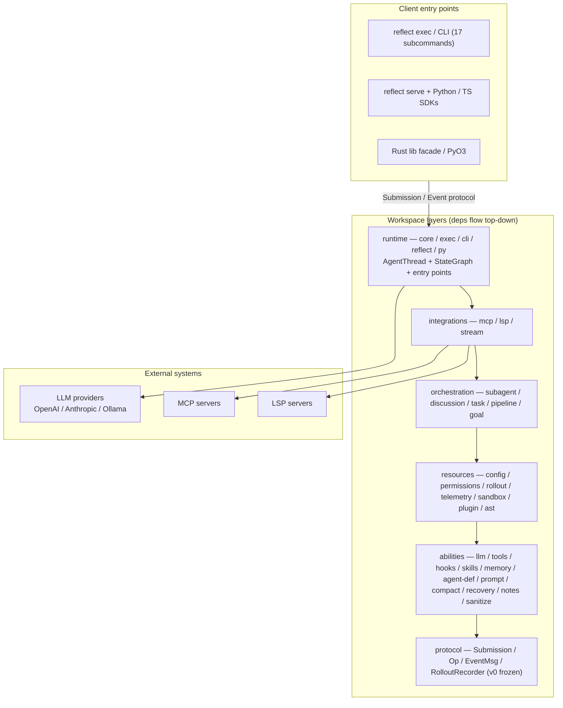
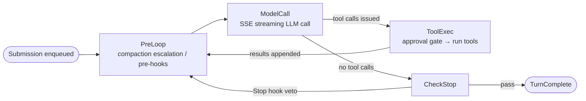

# Reflect

**English** | [简体中文](README.md)

> An AI agent runtime **framework** written in Rust: a 33-crate workspace
> (6-layer architecture), a 4-node StateGraph engine, 23 built-in tools,
> 8 hook events, multiple LLM providers, MCP / LSP integration, and JSONL
> rollout persistence.
>
> This repository is a **pure framework layer**: the primary interfaces are
> the `reflect` library facade (Builder + 60+ re-exports) and the Rust /
> Python / TypeScript integration entry points; `reflect-cli` is just a thin
> headless entry produced alongside it (a single `reflect` binary, including
> the `serve` subcommand used by the SDKs).
>
> Script ecosystems (Python / TS) can embed the framework directly via
> `reflect serve` + the official SDKs: spawn the binary, speak the JSONL
> stdio protocol, and **register local functions as custom tools the LLM
> can call** — the Rust engine handles inference and orchestration while
> business logic stays in the host language.

**0.0.1** · 33 crates · **2200+ tests** · Apache-2.0

## Differentiators

Most agent tools in this space ship as a **black-box CLI**: a single
executable with an opaque internal loop that users can only drive as a
terminal consumer. Reflect takes the opposite stance — an **embeddable,
auditable, extensible agent runtime framework**:

| Dimension | Typical agent CLI | Reflect |
|-----------|-------------------|---------|
| Product form | Single black-box executable, only "usable" | **Pure framework + multilingual entry points**: the `reflect` Rust lib facade (Builder + 60+ re-exports), PyO3 bindings, `reflect serve` + official Python / TS SDKs; the CLI is a thin add-on entry you can embed in your own product |
| Control flow | Opaque internal loop, no intervention points | **Explicit 4-node StateGraph** (PreLoop → ModelCall → ToolExec → CheckStop): hand-written transitions, auditable; a Stop hook can veto completion and force the turn to continue |
| Client protocol | Interaction logic locked inside the process | **Frozen Submission / Op / EventMsg wire protocol (v0)**: any client in any language drives the agent over the same protocol; adding variants never breaks existing SDKs |
| Custom tools | Tools must live inside the CLI process or behind a separate MCP server | **Host-language functions registered directly as LLM tools**: the core dispatches execution requests; Python / TS handlers run locally and reply — tool code never enters the Rust process |
| Tool-surface trimming | Fixed toolset, take it or leave it | **Config-driven tool trimming**: agent-definition frontmatter (`tools` allowlist / `disallowed_tools` denylist / `readonly`), `allowed_tools` per `[[subagents]]` in config.toml, or ToolRegistry add/remove in code; trimmed tools' schemas are never sent to the LLM — smaller tool surface, fewer misfires, fewer tokens |
| Resident sessions | Cold start per invocation | **`reflect serve` resident session service**: one process = one resident AgentThread, in-memory state shared across turns + resume; SDKs embed it as a subprocess |
| Multi-agent | Ad-hoc scripting | **First-class orchestration layer**: subagents (Tool-per-Agent), sequential / concurrent discussion, tasks / teams, DAG pipelines, goal mode |
| Context management | Truncation or a single summarization pass | **4-tier compaction escalation**: microcompact → smart_prune → LLM summarize, upgraded stepwise by token threshold |
| Extension surface | Scattered flags and config files | **hooks (8 events × 7 decisions) + Tool trait + MCP + LSP + plugins + skills** — layered, independent extension mechanisms |
| Session auditing | Scattered logs, hard to replay | **JSONL rollout persistence** + resume + session index + full LLM call traces on disk |
| Security boundary | Per-action human confirmation | **Permissions rule engine + multi-level sandbox + Plan mode** (write tools blocked until research completes and `ExitPlanMode` is called) |
| Automation / CI | Parsing natural-language output | **JSONL stdout + stderr logs** are pipe-friendly (`reflect exec \| jq`); built-in mock provider keeps examples / e2e / SDK tests **fully offline** |
| Runtime dependency | Depends on a host language runtime | **Single Rust binary** (MSRV 1.85), no external runtime |

In one sentence: a typical agent CLI is a tool you *use*; Reflect is a
runtime you *build agent products on* — the frozen protocol, the explicit
StateGraph, cross-language tools, and the resident serve mode all serve
that goal: inference and orchestration run in the Rust engine while your
business logic stays in your own language and process.

## Architecture Overview

Clients (TUI / exec / serve / lib) drive the same engine over one frozen
Submission / Event protocol; the six workspace layers depend strictly
top-down, with protocol as the common contract for all layers:



Each turn is driven by `submission_loop` through the 4-node StateGraph,
with hand-written, auditable transitions:



### Workspace layers (dependencies flow top-down)

| Layer | Crates | Responsibility |
|-------|--------|----------------|
| `protocol/` | reflect-protocol | Submission / Op / EventMsg / Item + RolloutRecorder trait. The common contract for all layers |
| `abilities/` | llm, tools, hooks, skills, memory, agent-def, prompt, compact, recovery, notes, sanitize | Capability primitives: ModelClient trait + providers, Tool trait + built-in tools, HookEngine, compaction escalation, etc. |
| `resources/` | config, permissions, plugin, rollout, telemetry, sandbox, ast | Config hot-reload, permission rules, plugin lifecycle, JSONL persistence, tree-sitter code search |
| `orchestration/` | subagent, discussion, task, pipeline, goal | Multi-agent orchestration: subagent factory (in-flight ≤ 16), discussion orchestration, tasks/teams, DAG pipelines, goal mode |
| `integrations/` | mcp, lsp, integration, stream | MCP client (stdio/streamable-http), LSP, streaming session backend |
| `runtime/` | core, exec, cli, reflect, py | AgentThread + StateGraph, headless, CLI entry, lib facade (60+ re-exports + Builder), PyO3 bindings |

### Core data flow

- `AgentThread` (reflect-core) consumes `Submission`s (mpsc channel);
  `submission_loop` drives the 4-node `StateGraph`:
  **PreLoop → ModelCall → (ToolExec → PreLoop)\* → CheckStop**.
  When the model stops issuing tool calls, CheckStop ends the turn
  (a Stop hook may veto and force the turn to continue).
- `NodeContext` carries per-turn dependencies: model registry, RoutingPolicy,
  HookEngine, ToolExecutionQueue, event channel, CancellationToken,
  approval gates.
- Clients (TUI / exec / serve / lib) all communicate through the same
  Submission/Event protocol; in headless mode Events stream to stdout as
  JSONL while tracing logs go to stderr (`reflect exec | jq` stays clean);
  `reflect serve` reuses the same protocol as a resident service that the
  SDKs wrap (remote tool requests/responses, approvals, etc. are all
  protocol-level Op / EventMsg variants).

### Key design decisions

- **Protocol v0 is frozen**: adding Op/EventMsg variants is non-breaking; existing variants never change
- **JSONL to stdout, logs to stderr**: `reflect exec | jq` is never corrupted
- **ToolError lives in reflect-protocol**: breaks the tools ↔ hooks dependency cycle
- **StateGraph via enum + match**: fixed 4-node structure, no petgraph
- **Error handling**: `thiserror` for library crates, `anyhow` for application layers (exec/cli)
- **serve is an embedding entry, not a dev assistant**: built-in hooks are disabled by default (exec / TUI keep "unconfigured = all enabled"), so Stop hooks like `verification` never run tests in the host's cwd

See [docs/architecture.md](docs/architecture.md) (Chinese) for the full
33-crate directory tree and per-node StateGraph responsibilities.

## Features

| Capability | Implementation |
|------------|----------------|
| 4-node StateGraph | PreLoop → ModelCall → ToolExec → CheckStop self-loop |
| OpenAI + Anthropic + Ollama | SSE streaming, prompt caching, extended thinking, local NDJSON |
| 23 built-in tools | bash / read / write / edit / grep / glob / web_fetch / web_search / notebook_edit / image_view / task tools + Plan-mode control plane, etc. |
| Trimmable tool surface | Three layers: agent-definition frontmatter (`tools` / `disallowed_tools` / `readonly`, activated via `--agent`) → `allowed_tools` per `[[subagents]]` in config.toml → code-level `unregister` / `register_except`; trimmed tools' schemas never reach the prompt (see [docs/architecture.md](docs/architecture.md), Chinese) |
| Cross-language custom tools | Clients (Python / TS) register local functions as LLM tools; the core dispatches execution requests and receives results back |
| 8 hook events × 7 decisions | PreToolUse / PostToolUse / PostToolUseFailure / Stop / SessionStart + 3 task-lifecycle events |
| 4-tier context compaction | microcompact → smart_prune → LLM summarize (escalation) |
| Subagents | Tool-per-Agent, concurrent in-flight ≤ 16 (shared parent/child counter) |
| Multi-agent orchestration | discussion (sequential/concurrent), task / team, DAG pipelines, goal mode |
| Python / TypeScript SDKs | Pure stdlib / zero native dependencies; spawn `reflect serve` over the JSONL stdio protocol |
| Persistence | JSONL rollout + resume + session index + LLM trace recording |
| MCP | stdio / streamable-http transports + tool prefix + reload diff |
| LSP | LSP server configuration management and integration |
| Plugins | install / enable / disable / uninstall + marketplace |
| Permissions & sandbox | permissions rule engine + multi-level sandbox |
| Plan mode | `reflect exec --plan-mode` + `EnterPlanMode` / `ExitPlanMode` tools |
| Configuration | unified TOML + notify hot-reload + CLI subcommands |
| CLI | single `reflect` binary + 17 subcommands (incl. `serve`) |
| Built-in mock provider | `REFLECT_MODEL=mock` + scripted replies; examples / e2e / SDK tests run fully offline |
| Testing | 2200+ tests · wiremock · insta snapshots · cross-platform CI |

## Quick Start

```bash
# 1. Build (requires Rust 1.85+, pinned by rust-toolchain.toml)
git clone https://cnb.cool/Demon1019/Reflect-Agent && cd Reflect-Agent
cargo build --release            # whole workspace (libs + binary); `make build` builds only the CLI

# 2. Set an API key (pick one of three)
export OPENAI_API_KEY=sk-...
# or
export ANTHROPIC_API_KEY=sk-ant-...
# or persist it to the config file
./target/release/reflect login --provider anthropic --api-key sk-ant-...

# 3. Rust library integration — the framework's primary interface (one-line Builder start)
cargo run -p reflect --example headless_run -- "say hi"
# More examples: custom_tool / multi_turn / custom_provider / hook_listener / discussion_demo

# 4. Headless one-shot conversation (thin CLI entry; JSONL Event stream to stdout, logs to stderr)
./target/release/reflect exec "what is 2+2?" | jq -c '.msg.type'

# 5. Python / TypeScript embedding — spawn `reflect serve` over the JSONL stdio protocol
export REFLECT_BIN=./target/release/reflect     # how the SDK locates the binary (or install it on PATH)
python3 - <<'EOF'
import sys; sys.path.insert(0, "sdks/python")
from reflect import ReflectAgent
agent = ReflectAgent.spawn()          # returns once the handshake (session_configured) completes
print(agent.prompt("hello"))          # aggregates deltas into the final text
agent.close()
EOF

# 6. Continue the previous session
./target/release/reflect exec -c

# 7. Plan mode — read-only research mode
./target/release/reflect exec --plan-mode "summarize the auth module"
```

Offline development: examples and e2e scripts use `REFLECT_MODEL=mock` to skip
real LLM network calls.

## Multilingual SDKs (Python / TypeScript)

Script projects embed the framework via `reflect serve` (a resident stdio
JSONL session: one process = one resident AgentThread, in-memory state
shared across turns) plus the official SDKs. The standout capability:
**register host-language functions as LLM-callable custom tools**:

```python
from reflect import ReflectAgent, ToolOutput, ContentBlock

agent = ReflectAgent.spawn()

def get_weather(args):
    return ToolOutput(
        content=[ContentBlock(type="text", text=f"{args['city']}: sunny")],
        is_error=False, metadata={}, elapsed_ms=0,
    )

agent.register_tool("get_weather", "Get weather for a city",
                    {"type": "object",
                     "properties": {"city": {"type": "string"}},
                     "required": ["city"]},
                    get_weather)          # local function -> LLM tool
print(agent.prompt("What's the weather in Beijing?"))   # aggregates deltas
agent.close()
```

The TypeScript API is isomorphic (`ReflectAgent.spawn()` / `registerTool` /
`prompt`). See **[docs/sdk.md](docs/sdk.md)** (Chinese) for the full
integration guide (both languages, the remote-tool execution flow, the
`submit` / `interrupt` / `approve` advanced surface, offline debugging);
the wire protocol spec is [`sdks/PROTOCOL.md`](sdks/PROTOCOL.md).

## CLI Subcommands

| Subcommand | Purpose |
|------------|---------|
| `reflect exec` | One-shot headless run, JSONL Event stream to stdout (supports `-c` / `-r N` / `--resume <uuid>` / `--agent <name>` / `--plan-mode`) |
| `reflect serve` | Resident stdio JSONL session service (protocol entry for the Python / TS SDKs; one Submission per stdin line, one Event per stdout line; supports the same resume flags) |
| `reflect discussion` | Multi-agent discussion orchestration (`run -c <toml>` / `ls`) |
| `reflect login` | Write provider credentials to `~/.reflect/config.toml` |
| `reflect mcp` | MCP server configuration (`ls` / `add` / `remove` / `test` / `show`) |
| `reflect config` | Config read/write (`show` / `set` / `unset` / `edit` / `ls`) |
| `reflect session` | Persistent session management (`ls` / `show` / `rm` / `fork` / `rename` / `export`) |
| `reflect traces` | Browse local LLM call records (`ls` / `show`; data in `~/.reflect/traces/model-io/`) |
| `reflect doctor` | Best-effort environment self-check (supports `--check-network`) |
| `reflect plugin` | Plugin install / list / enable / disable / uninstall + marketplace |
| `reflect lsp` | LSP server configuration management |
| `reflect task` | Structured tasks + teams (TaskCreate / TaskList / TeamCreate, etc.) |
| `reflect pipeline` | DAG pipelines (team-plan → team-prd → team-exec → team-verify) |
| `reflect security` | Security scan (cargo audit) |
| `reflect workspace` | git clone / sync for workspaces |
| `reflect update` | Print upgrade notes (currently offline) |
| `reflect version` | Print the version |

### Resume flags

`-c` / `-r N` / `--resume <uuid>` are mutually exclusive (a clap group):

```bash
reflect exec -c "continue the previous work"    # resume the most recent session
reflect exec -r 2 "follow up on the second one" # by index
reflect exec --resume <uuid>                    # by UUID
```

### Typical workflows

```bash
# First-time setup
reflect login --provider anthropic --api-key sk-ant-...
reflect exec "hello"

# Attach an MCP filesystem server
reflect mcp add filesystem --command npx \
                          --args "-y" \
                          --args "@modelcontextprotocol/server-filesystem" \
                          --args "$HOME"
reflect mcp test filesystem

# Switch models
reflect config set anthropic.model claude-3-haiku-20240307
# ConfigWatcher hot-reloads automatically

# Troubleshooting
reflect doctor --check-network
RUST_LOG=debug reflect exec "hello" 2>debug.log

# Continue a session
reflect session ls
reflect exec -c "continue where we left off"
```

## Plan Mode

Plan mode produces a complete plan before the agent runs write tools
(`bash` / `write` / `edit`): the `PlanModeGate` hook blanket-denies write
tools (read-only tools like read / grep / glob remain available), and after
finishing research the agent calls `ExitPlanMode` to present the plan and
leave Plan mode.

```bash
reflect exec --plan-mode "refactor X"   # headless research (read-only)
```

## Examples

| Example | Demonstrates | Command |
|---------|--------------|---------|
| `headless_run` | Minimal one-shot prompt | `cargo run -p reflect --example headless_run -- "..."` |
| `custom_tool` | Custom Tool implementation | `cargo run -p reflect --example custom_tool` |
| `multi_turn` | Multiple turns on one agent with history | `cargo run -p reflect --example multi_turn` |
| `custom_provider` | Offline MockLlmClient | `cargo run -p reflect --example custom_provider` |
| `hook_listener` | TokenUsage + DangerousCommand hooks | `cargo run -p reflect --example hook_listener` |
| `discussion_demo` | 3-agent discussion demo | `cargo run -p reflect --example discussion_demo` |

## Environment Variables

| Variable | Required | Description |
|----------|----------|-------------|
| `OPENAI_API_KEY` | one of | OpenAI provider |
| `ANTHROPIC_API_KEY` | one of | Anthropic provider |
| `OLLAMA_HOST` | no | Ollama `base_url` (full URL incl. scheme) |
| `OLLAMA_API_KEY` | no | Ollama Cloud / reverse-proxy Bearer |
| `REFLECT_PROVIDER` | no | Force a provider (overrides TOML `[active]`) |
| `REFLECT_MODEL` | no | Override the default model spec; `=mock` runs examples / e2e / SDKs offline |
| `REFLECT_MOCK_SCRIPT` | no | Mock provider script (JSONL, one line per model call: text / tool_call) |
| `REFLECT_REMOTE_TOOL_TIMEOUT_SECS` | no | serve-mode timeout waiting for remote tool replies (default 120s) |
| `REFLECT_BIN` | no | Where SDKs locate the `reflect` binary (default: PATH) |
| `REFLECT_HOME` | no | Data directory override (default `~/.reflect`) |
| `REFLECT_AUTO_COMPACT_INPUT_TOKENS` | no | Compaction threshold (default 10,000) |
| `REFLECT_MAX_ITERATIONS` | no | Graph execution safety valve (max iterations) |
| `REFLECT_SANDBOX_*` | no | Sandbox policy (`STRICT` / `OS_LEVEL` / `WRITABLE`) |
| `RUST_LOG` | no | tracing filter (default `warn,reflect=info`) |

## Documentation

| Document | Contents |
|----------|----------|
| [`docs/architecture.md`](docs/architecture.md) | Architecture deep dive (Chinese): full directory tree, core data flow, per-node duties, design decisions |
| [`docs/sdk.md`](docs/sdk.md) | SDK integration guide (Chinese): serve mode, Python / TS examples, remote-tool flow, offline debugging |
| [`AGENTS.md`](AGENTS.md) | Development guide: commands, architecture layers, project conventions |
| [`sdks/PROTOCOL.md`](sdks/PROTOCOL.md) | serve wire protocol spec (shared implementation basis for the SDKs) |
| [`sdks/python/README.md`](sdks/python/README.md) | Python SDK usage and installation |
| [`sdks/typescript/README.md`](sdks/typescript/README.md) | TypeScript SDK usage and installation |

## Development

```bash
make check                                # cargo check --workspace
make check-fast C=reflect-core            # fast check for a single crate
cargo test --workspace                    # 2200+ tests
make test-fast                            # cargo nextest (must be installed)
make test-changed                         # run only tests affected by changes since HEAD
cargo clippy --workspace --all-targets -- -D warnings   # strict lint
cargo fmt --all                           # formatting
./scripts/e2e.sh                          # 15-step e2e smoke (build + examples + headless + serve + SDK + test + clippy)
./scripts/sdk_smoke.sh                    # offline smoke of both SDKs against the real binary (build release first)
./scripts/bench.sh                        # performance baselines (cold start / first event / RSS)
./scripts/discussion_smoke.sh             # discussion orchestration smoke
(cd sdks/typescript && npm test)          # TS SDK tests (Node mock serve, offline)
(cd sdks/python && python3 -m pytest)     # Python SDK tests (Node mock serve, offline)
make dist                                 # package DMG / tar.gz / zip into dist/
make gc                                   # clean intermediate artifacts cargo won't GC from target/
```

## Roadmap

Future plans include MCP OAuth, PostgreSQL session storage, IDE plugins,
npm per-platform binary packages and PyPI publishing (the SDKs are
currently used directly from the `sdks/` source directory), and more.

## License

Apache-2.0
