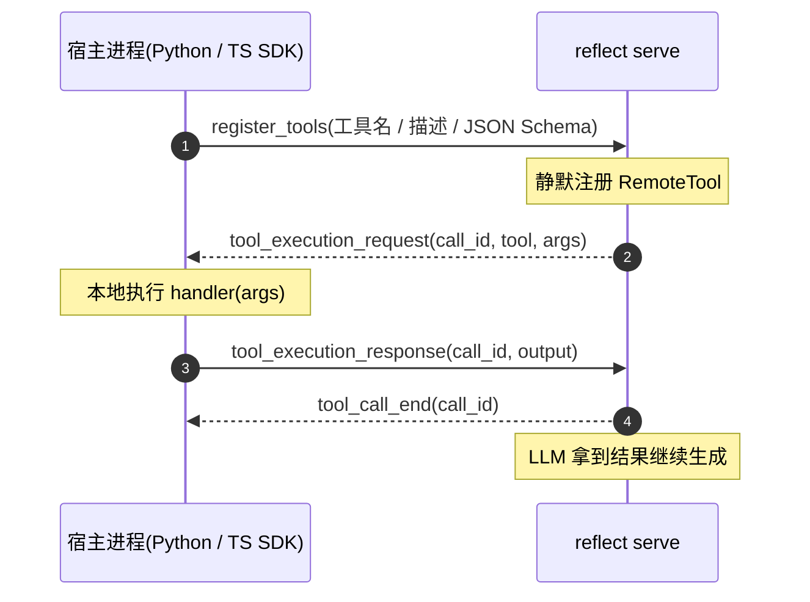

# SDK 接入指南(Python / TypeScript)

> 脚本项目不需要写 Rust 也能完整驱动本框架:`reflect serve` 提供常驻
> stdio JSONL 会话(一个进程 = 一个常驻 AgentThread,多轮共享内存状态,
> 支持 resume),官方 SDK 在其上封装出符合各自语言习惯的 API ——
> **推理与编排在 Rust 引擎,业务逻辑留在宿主语言**。

最有特点的能力是**跨语言自定义工具注册**:把 Python / TS 函数声明成
工具(JSON Schema 参数),LLM 调用时 core 下发 `tool_execution_request`,
SDK 在本地执行 handler 并回执 —— 工具实现无需进 Rust 进程:



超时与错误语义:回执等待上限由 `REFLECT_REMOTE_TOOL_TIMEOUT_SECS`
控制(默认 120s);handler 抛异常时 SDK 应转成 `is_error=true` 的文本
回执,让 LLM 看到错误而不是挂死。完整 wire 协议(握手 / 审批 / 退出
语义)见 [`sdks/PROTOCOL.md`](../sdks/PROTOCOL.md)。

## Python

`sdks/python`,纯 stdlib 零依赖;二进制定位:`REFLECT_BIN` env →
PATH 上的 `reflect`:

```python
from reflect import ReflectAgent, ToolOutput, ContentBlock

agent = ReflectAgent.spawn()

def get_weather(args):
    return ToolOutput(
        content=[ContentBlock(type="text", text=f"{args['city']} 晴")],
        is_error=False, metadata={}, elapsed_ms=0,
    )

# 本地函数 → LLM 可调用的工具
agent.register_tool("get_weather", "查询城市天气",
                    {"type": "object",
                     "properties": {"city": {"type": "string"}},
                     "required": ["city"]},
                    get_weather)

for ev in agent.submit("北京天气如何?"):        # 阻塞式迭代器,增量事件
    if ev["msg"]["type"] == "agent_message_delta":
        print(ev["msg"]["delta"], end="", flush=True)
    if ev["msg"]["type"] == "turn_complete":
        break
agent.close()
```

## TypeScript

`sdks/typescript`,纯 TS 零运行时依赖,API 与 Python 版同构:

```ts
import { ReflectAgent } from 'reflect-agent';

const agent = await ReflectAgent.spawn();
await agent.registerTool(
  'get_weather', '查询城市天气',
  { type: 'object', properties: { city: { type: 'string' } }, required: ['city'] },
  (args) => ({
    content: [{ type: 'text', text: `${args.city} 晴` }],
    is_error: false, metadata: {}, elapsed_ms: 0,
  }),
);

const text = await agent.prompt('北京天气如何?');   // 聚合增量文本
await agent.close();
```

## 高级面

两套 SDK 的共同能力:

- `submit()` 返回按 submission id 过滤的事件流 —— 并发提交多轮互不干扰
  (serve 侧 core 串行排队,事件按各自 `id` 路由);
- `interrupt()` 打断当前 turn(该 turn 以 `turn_aborted` 收尾);
- `approve()` 响应 `approval_request` 审批请求(approve / deny + reason);
- 协议未知事件类型自动降级 —— 协议 v0 冻结但允许新增变体,框架加变体
  不断 SDK。

## 离线联调

```bash
# 免 API key、无网络:内置 mock provider(REFLECT_MOCK_SCRIPT 可脚本化每次模型回复)
REFLECT_MODEL=mock ./scripts/sdk_smoke.sh   # 对真实二进制跑两套 SDK 全链路(需先构建 release)
```

## 延伸阅读

| 文档 | 内容 |
|------|------|
| [`sdks/PROTOCOL.md`](../sdks/PROTOCOL.md) | serve wire 协议规范(握手 / 工具执行流 / 审批回执 / 退出语义),任何语言手写集成的依据 |
| [`sdks/python/README.md`](../sdks/python/README.md) | Python SDK 安装、用法与 pytest 测试 |
| [`sdks/typescript/README.md`](../sdks/typescript/README.md) | TypeScript SDK 安装、用法与 npm test |
